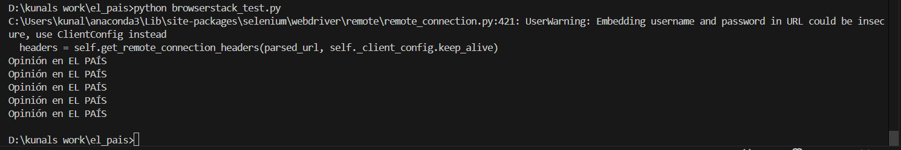
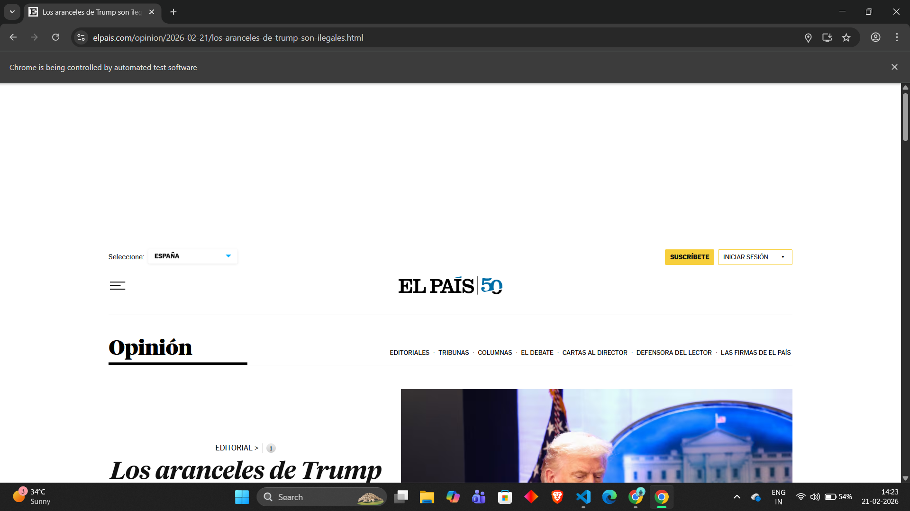
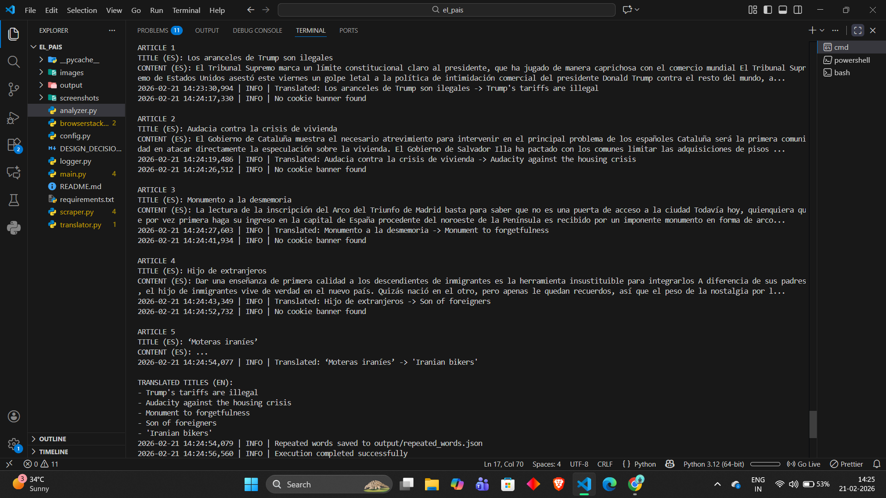
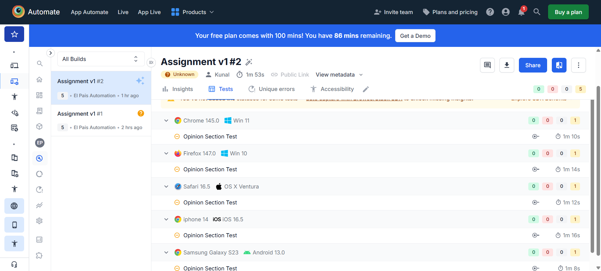
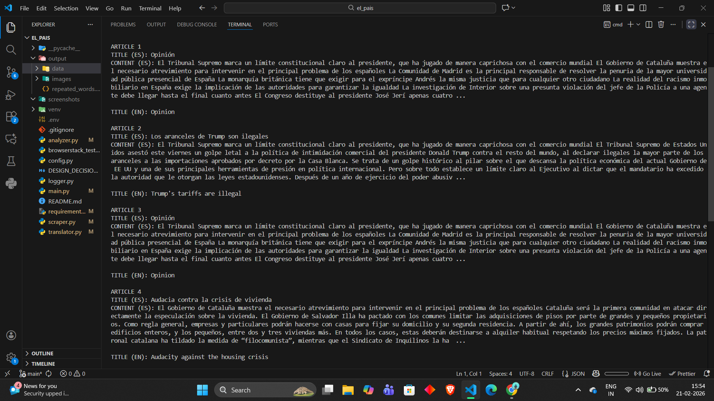

## El País Selenium Automation Project

### Features
- Scrapes Opinion articles
- Verifies Spanish language
- Downloads article images
- Translates titles to English
- Identifies repeated words
- Runs locally and on BrowserStack

### Local Execution
```bash
pip install -r requirements.txt
python main.py --articles 5
```


### Screenshots







## Scraped Article Images


## Issues Faced During Implementation

1. **Cookie Consent Popups**  
   While scraping El País, cookie consent banners sometimes blocked access to page content.  
   This was handled by allowing page load completion and interacting with visible elements only after cookies were accepted or bypassed.

2. **Inconsistent Article Heading Structure (H1 / H2)**  
   Some Opinion articles used a generic `H1` tag such as *"Opinión"* instead of the actual headline.  
   In such cases, the scraper correctly extracted the main `H1` element as per DOM structure, which resulted in repeated titles.(Screenshot 5).  
   This behavior was expected and handled during repeated-word analysis.